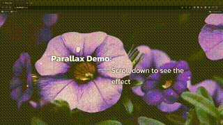

# Parallax Demo 🌌

This project showcases a basic parallax scrolling effect built with HTML, CSS (SCSS), and JavaScript. Experience the depth effect created by different layers moving at varying speeds during scrolling.

---

## Table of Contents 📚
- [Features](#features-)
- [Demo](#demo-)
- [Tech Stack](#tech-stack-)
- [Prerequisites](#prerequisites-)
- [Installation](#installation-)
- [How to Use](#how-to-use-)
- [Project Structure](#project-structure-)
- [Credits](#credits-)
- [Author](#author-)

---

## Features 🌟
- 🌈 Multi-layered parallax effect
- 🎨 Uses CSS transformations for layers
- 🎛 Easily customizable styles and layers with SCSS
- 📦 No external libraries, pure vanilla CSS and JS
- 🖲 One very pointless button just for fun!

---

## Demo 🎥


---

## Tech Stack 💻
- HTML
- CSS (SCSS)
- JavaScript (React)

---

## Prerequisites 🔍
Make sure Node.js and npm are installed on your system. If they are not, download and install them from the official Node.js website.

---

## Installation 🛠
1️⃣ **Clone the repository**
```
git clone https://github.com/macleann/parallax-test-app.git
```
2️⃣ **Navigate to the project folder**
```
cd parallax-test-app
```
3️⃣ **Install dependencies**
```
npm install
```
4️⃣ **Start the project**
```
npm start
```
🌐 The application will open in your browser at http://localhost:3000/.

---

## How to Use 🎮
Scroll down to witness the parallax effect in action. Each section represents a unique "scene" with its own set of layers. Feel free to modify these scenes in App.js and App.scss.

---

## Project Structure 🏗
- App.js: Main React component where all sections and layers are defined.
- App.scss: Houses SCSS styles for maintainability and readability.
- App.css: Optional, but less DRY and not recommended.

---

## Credits 🙏
- Background images: [Lorem Picsum](https://picsum.photos/)
- Fonts: [Google Fonts](https://fonts.google.com/)
- Tutorials followed:
    - [Simple Pure CSS Parallax Scroll Tutorial](https://www.youtube.com/watch?v=rLrLJQBG_qo) by [Developer Filip](https://www.youtube.com/@developerfilip)
    - [This Simple Trick Makes Your Website 83% Better Looking](https://www.youtube.com/watch?v=mxHoPYFsTuk) by [Web Dev Simplified](https://www.youtube.com/@WebDevSimplified)

## Author
Neil MacLean - [LinkedIn](https://www.linkedin.com/in/neil-maclean/)